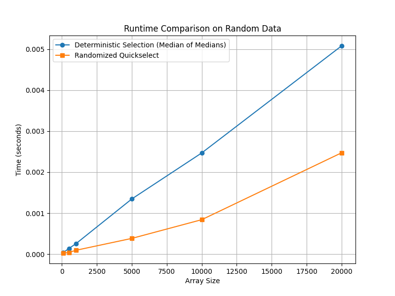
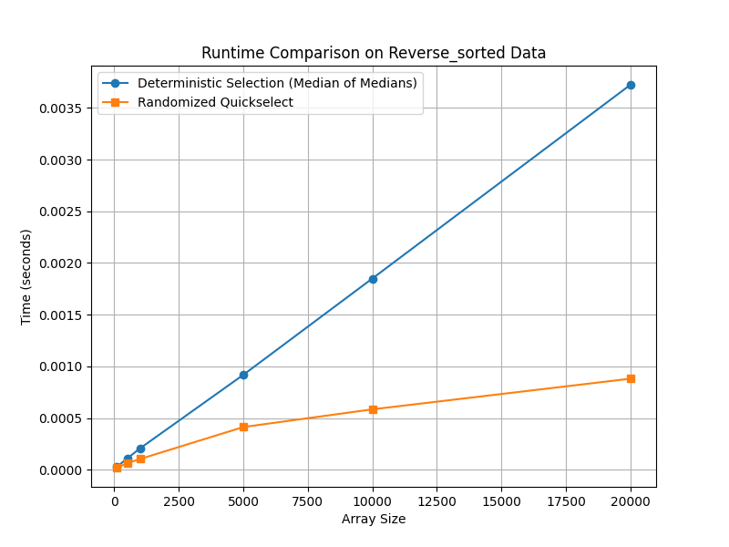

# Assignment 6: Medians and Order Statistics & Elementary Data Structures

## Part 1: Implementation and Analysis of Selection Algorithms

### Performance Analysis

The time complexity of the Deterministic algorithm (Median of Medians) and the Randomized algorithm (Quickselect) is analyzed using recurrence relations.

### A. Deterministic Algorithm (Median of Medians)

The Median of Medians algorithm selects a pivot by:

1. **Dividing** the array into groups of 5 elements.
2. **Finding** the median of each group.
3. **Recursively selecting** the median of these medians.
4. **Partitioning** the array.
5. **Recursively searching**.

This results in the recurrence:  
**T(n) = T(n/5) + T(7n/10) + O(n)**

Solving the recurrence using the master theorem, we get:  
**T(n) = O(n)**, which means the worst-case time complexity of the Median of Medians is **O(n)**.

---

### B. Randomized Algorithm (Quickselect)

The Quickselect algorithm selects a pivot randomly and partitions the array around it, which results in the following scenarios:

- **Best-case**: Pivot divides the array into nearly two equal halves, leading to  
  **T(n) = T(n/2) + O(n) → O(n)**

- **Worst-case**: If the selected pivot is the smallest or the largest element, recursion reduces by one element per step, leading to  
  **T(n) = T(n-1) + O(n) → O(n²)**

- **Expected-case**: Pivot divides the array into two balanced partitions, leading to  
  **T(n) = T(n/2) + O(n) → O(n)**

The Deterministic algorithm achieves **O(n)** in the worst case since the selected pivot is always between the 30th and 70th percentiles. The recursive step always reduces the array by at least 30%, ensuring balanced partitioning and resulting in **O(n)** in every case.

The Randomized algorithm, on average, divides the array into nearly equal halves. Due to this, the probability of repeatedly selecting bad pivots becomes low, leading to  
**T(n) = T(n/2) + O(n) → O(n)**.

The **space complexity** of the Deterministic algorithm is **O(log n)** due to the recursive calls stacking up logarithmically. The Randomized algorithm has a space complexity of **O(log n) on average and O(n) in the worst case**.

---

### Empirical Analysis

**Input sizes:** `{100, 500, 1000, 5000, 10000, 20000}`

#### 1. Random Data

- Randomized Quickselect is significantly **faster** than Median of Medians for small and medium inputs.
- The difference becomes more noticeable as the array size increases.

#### 2. Sorted Data

- Quickselect starts **performing worse** compared to random data because it frequently picks bad pivots.
- Median of Medians remains **stable** as it always selects a good pivot.

#### 3. Reverse-Sorted Data

- Quickselect results in **even worse performance** than on sorted data due to frequent poor pivot selections.
- Median of Medians performs similarly to sorted data since it does not rely on randomness.

---

## Part 2: Elementary Data Structures Implementation and Discussion

### Performance Analysis

The **time complexity** for basic operations in each data structure varies:

- **Array**: Provides **O(1)** access time due to indexing but has **O(n)** complexity for insertion or deletion.
- **Stacks**: Have **O(1)** push and pop operations since elements are added/removed from the end.
- **Queues**: Have **O(1)** enqueue and dequeue operations.
- **Linked List**: Allows **O(1)** insertion and deletion at the head or tail but requires **O(n)** for random access.

### Trade-offs Between Arrays and Linked Lists for Implementing Stacks and Queues

- **Arrays** are efficient for memory allocation and access time but introduce resizing overhead when the structure grows.
- **Linked Lists** dynamically allocate memory and avoid resizing issues but require additional memory due to pointer storage.

**Key insights:**
- If the stack or queue size is known, **arrays** are a better choice.
- If frequent insertions and deletions are needed, **linked lists** perform better since they avoid element shifting.
- If memory is constrained, **arrays** are preferred as they eliminate pointer overhead.

---

### Discussion

Each data structure serves different practical applications:

1. **Arrays**: Used in databases for indexing, gaming, and image processing.
2. **Stacks**: Essential in function call management, text editors, and certain algorithms.
3. **Queues**: Used in operating system scheduling and messaging queues (e.g., Kafka).
4. **Linked Lists**: Useful in memory management, such as caching.

From the analysis:

1. **For fast lookups**, arrays are best due to direct access.
2. **For frequent insertions/deletions**, linked lists are more efficient.
3. **If memory is constrained**, arrays are preferred since they avoid pointer overhead.
4. **For dynamic data**, linked lists are better suited.

---
